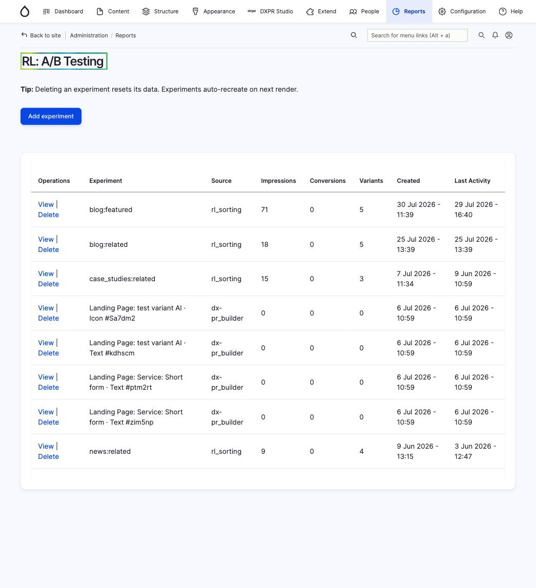
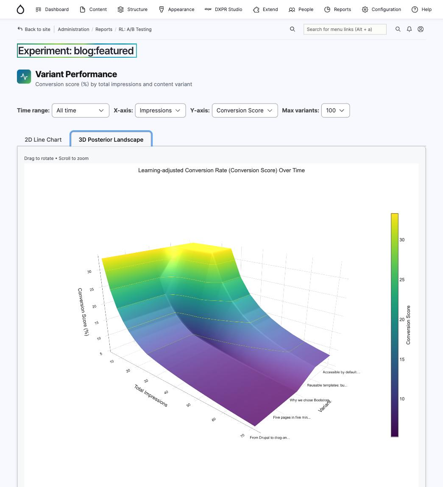

# Configuration

## Module settings

After enabling the module, visit **Administration > Configuration >
Web services > RL: A/B Testing**
(`/admin/config/services/reinforcement-learning`) to configure the module.

<!-- TODO: screenshot of the RL settings form -->

You can also manage settings via Drush:

```bash
# List all settings with current values
drush rl:config:list

# Get a specific setting
drush rl:config:get debug_mode

# Set a specific setting
drush rl:config:set event_log_max_rows 50000
```

See the [Drush commands guide](../guides/drush.md) for the full reference.

## Choosing a variant selection strategy

RL supports two approaches for deciding which variant to show. Pick the one
that fits your caching setup.

### Server-side (preferred)

Pick the winning variant in PHP at render time whenever you can. Your
consumer already has the full arm set in hand (entity fields, view
filters, plugin config), so it can call the RL service directly:

```php
$scores = $experiment_manager->getThompsonScores(
  'my_experiment',
  NULL,
  ['v0', 'v1', 'v2'],
);
arsort($scores);
$best_arm = key($scores);
```

Deciding server-side keeps the arm list where it belongs (with the
experiment owner) and avoids a network round trip on every page load.
See `rl_sorting`'s Views sort plugin for the canonical pattern and
`VariantSelectorBase` in this module for a reusable base class. The
[Building a Consumer Module](../guides/integrations.md) guide walks
through both bundled submodules as worked examples.

### Client-side (cache-friendly path)

Some consumers have to decide in JS: full-page-cached builders that
render all variants into the HTML and swap them on the client so they
can keep Varnish/Fastly caching. For that case there is
`Drupal.rl.decide()`, documented in the [JavaScript API](../api/javascript.md).

## Viewing reports

Once experiments are running and collecting data, visit
**Administration > Reports > RL** (`/admin/reports/rl`) to see
per-experiment performance, traffic distribution, and confidence levels.



Click **View** on any experiment to see its detail page with interactive
charts. The 2D line chart shows conversion scores over time; the 3D
posterior landscape visualises how Thompson Sampling distributions evolve
across variants and impressions.


